# Startup Connect

An online platform built with the MERN stack that connects startups, entrepreneurs, and investors. The application promotes entrepreneurship by providing support, funding opportunities, and event updates.

## Features

- Startup profiles and pitch submissions
- Investor review and acceptance of startup pitches
- Separate dashboards for entrepreneurs and investors
- Funding application management

## Tech Stack

- Frontend: React.js
- Backend: Node.js, Express.js
- Database: MongoDB
- Authentication: JWT
- Other: RESTful APIs

## 📸 Screenshots

### 🏠 Homepage
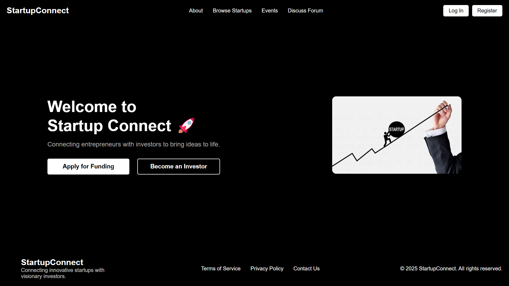

### 🔐 Login
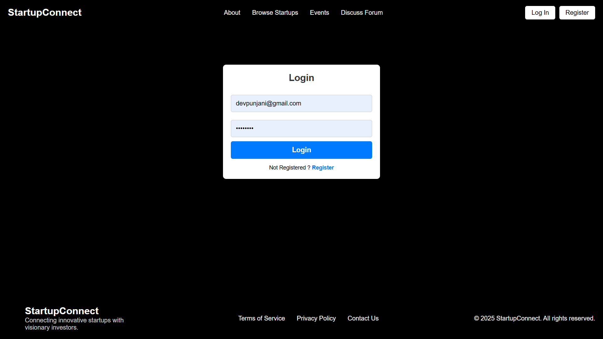

### 📝 Register
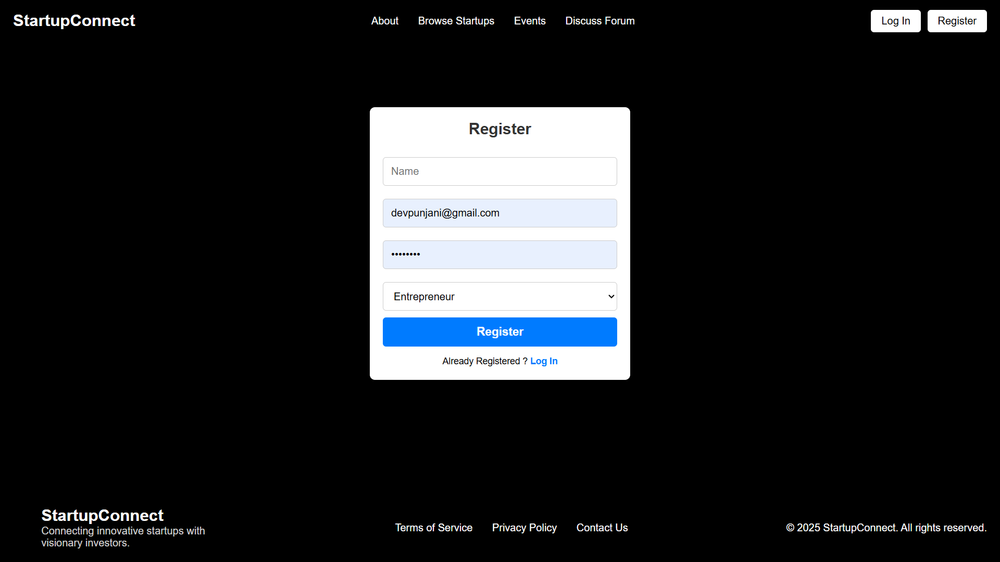

### 🧑‍💼 Entrepreneur Dashboard
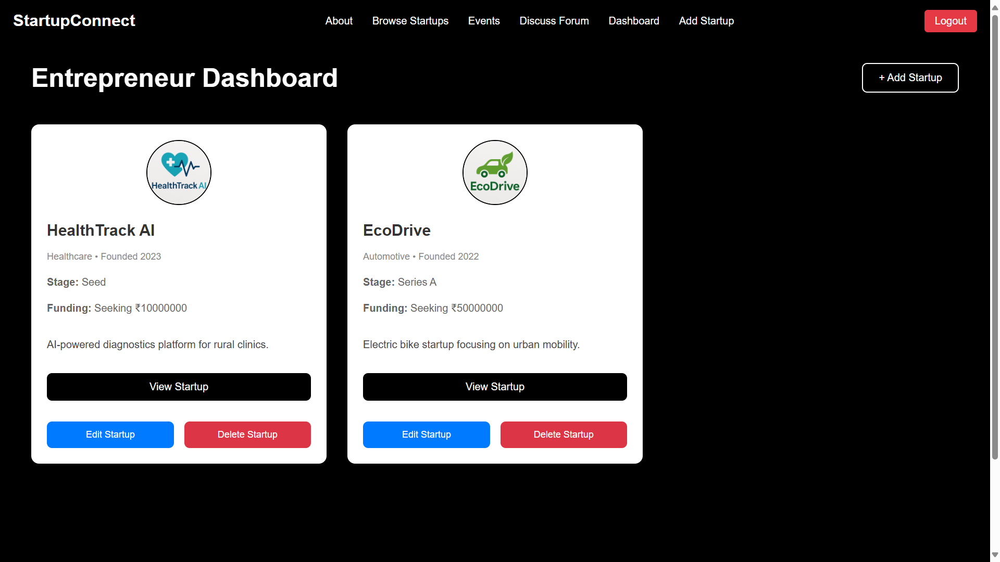

### 💼 Investor Dashboard
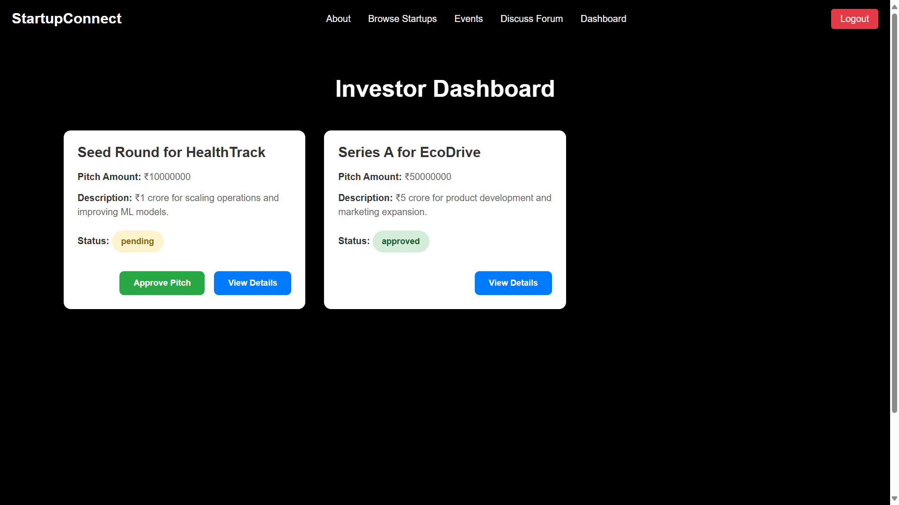

### 🌐 Browse Startups
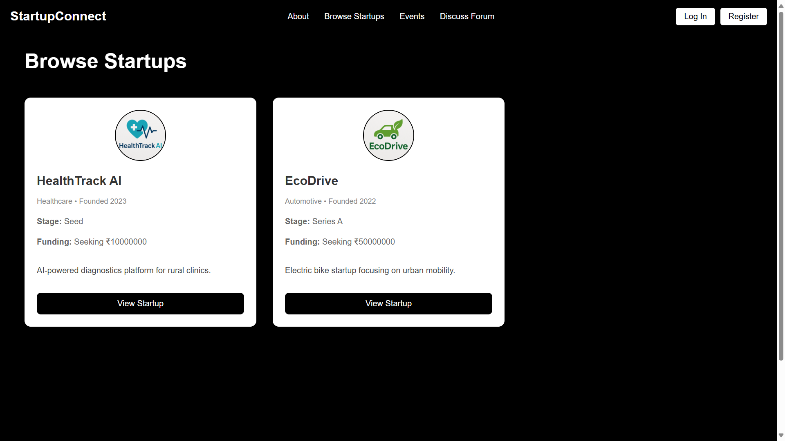

### 👁️ View Startup
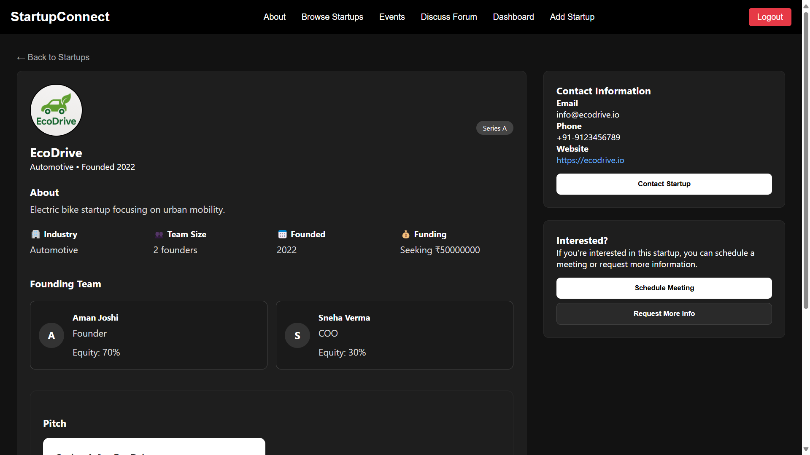

### 📈 Add Startup (Admin/Entrepreneur)

### 📤 Add Pitch
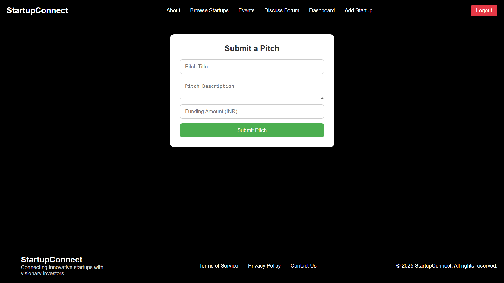

### ✏️ Edit Startup
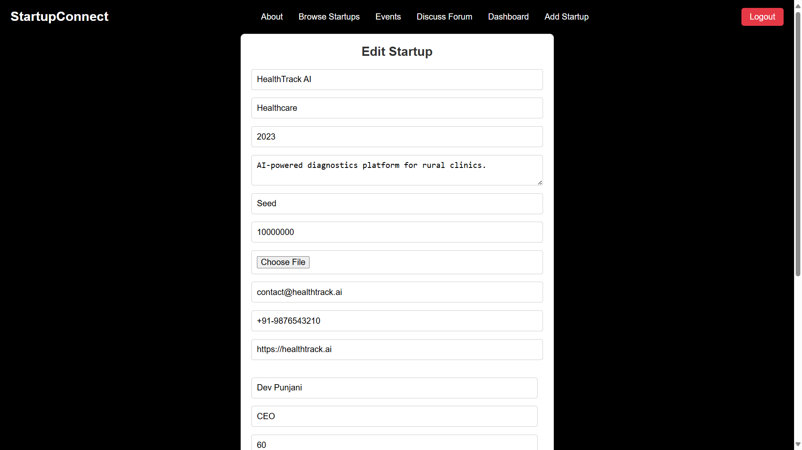

### 📣 Pitching Mode
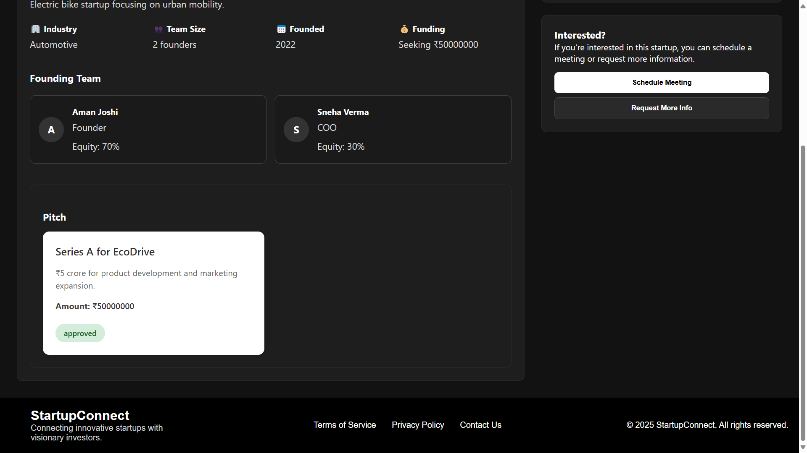

### 🚫 Not Pitching
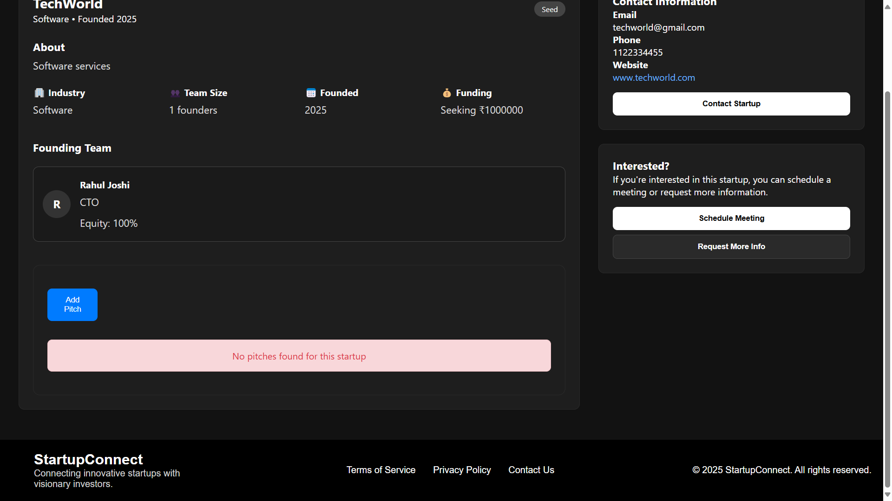

### 🧵 Discussion Forum (All Threads)
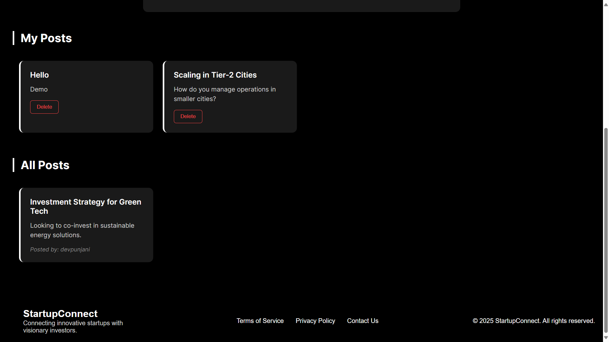

### 💬 Discussion Forum (User's Threads)
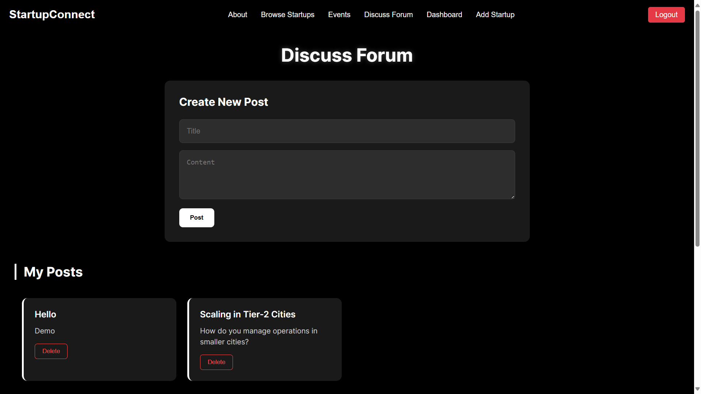
